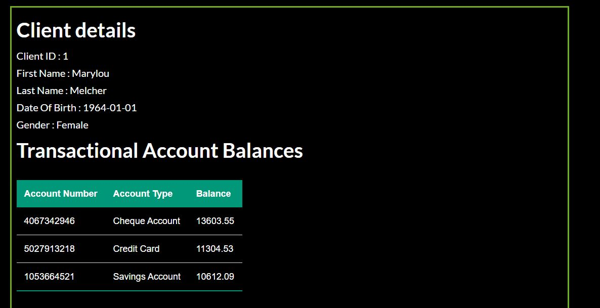
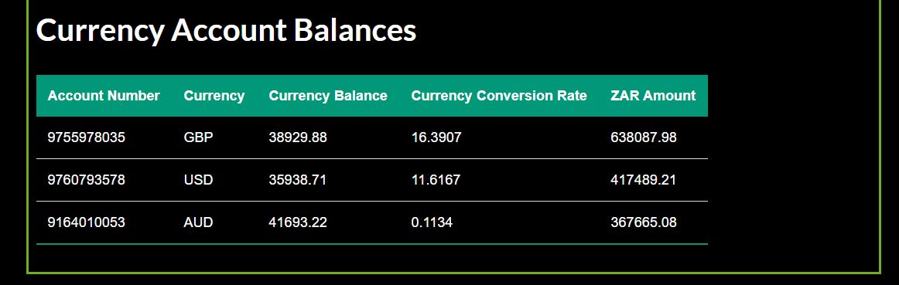

# Account Management System
## Backend layer
this includes repository, service and model packages .

### The backend layer (incomplete) :negative_squared_cross_mark:
:negative_squared_cross_mark: the service layer is incomplete.

:negative_squared_cross_mark: enntity with javax validation

:negative_squared_cross_mark: Exception handling with controller advice

:negative_squared_cross_mark: Unit testing


### The backend layer (completed) :+1:

:+1: jpa for backend mapping to retrieve all entities 

## Front end layer

### incompleted
:negative_squared_cross_mark: unit testing

:negative_squared_cross_mark: all the test scenarios

:negative_squared_cross_mark: monitoring and logging with ELK stack 

### done so far

:+1: just the first screen when you put the client id to get the client details

:+1: client details screen to display all of client accounts 

```java
@Controller
@RequestMapping("/")
public class AccountManagementController {

	@Autowired
	private BankController bankController;

	@GetMapping("/")
	public String searchCustomer(Model theModel) {
		theModel.addAttribute("client", new Client());
		return "index";
	}

	@GetMapping("/customer")
	public String showCustomer(@ModelAttribute("client") Client client, Model model) {
		Client selectedClient = bankController.getClientById(client.getClientId());
		model.addAttribute("selectedClient", selectedClient);
		List<ClientAccount> allAccounts = bankController.getAllClientAccountsById(selectedClient.getClientId());
		allAccounts.forEach(t->System.out.println("Account Number "+t.getClientAccountNumber()));
		return "customerDetails";
	}

}
```





