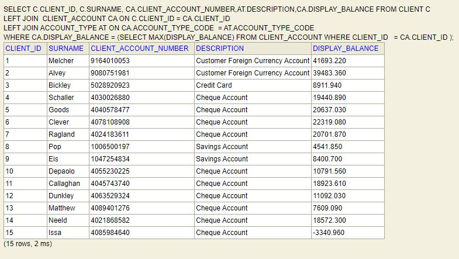

# Account Management System business requirements

## 1. Display transactional account with balances

> i have added a client/customer search screen where we can put the client id .


> client details screen 


> code snippet

```java

private Comparator<ClientAccount> byBalance = (cl1, cl2) -> cl2.getDisplayBalance()
			.compareTo(cl1.getDisplayBalance());

@GetMapping("/customer")
	public String showCustomer(@ModelAttribute("client") Client client, Model model) {
		Client selectedClient = bankController.getClientById(client.getClientId());
		model.addAttribute("selectedClient", selectedClient);
		List<ClientAccount> allAccounts = bankController.getAllClientAccountsById(selectedClient.getClientId());
		List<ClientAccount> trnscAccounts = allAccounts.stream()
				.filter(account -> account.getAccountTypeCode().getTransactional()).collect(Collectors.toList());
		trnscAccounts.sort(byBalance);
		model.addAttribute("accounts", trnscAccounts);
		return "customerDetails";
	}


```

## 2. Display currency account with converted rand value 

> for client id 1


> code snippet

```java 

private Comparator<CurrencyAccountDetails> byCurrBalance = (cl1, cl2) -> cl2.getZarAmount()
			.compareTo(cl1.getZarAmount());
			
public String showCustomer(@ModelAttribute("client") Client client, Model model) {
model.addAttribute("currencyAccounts", currencyAccountBalanceDetails(allAccounts));
		return "customerDetails";
	}

```

## 4.Reporting – Find the transactional account per client with the highest balance

```SQL
SELECT C.CLIENT_ID, C.SURNAME, CA.CLIENT_ACCOUNT_NUMBER,AT.DESCRIPTION ACCOUNT_DESCRIPTION,CA.DISPLAY_BALANCE FROM CLIENT C
LEFT JOIN  CLIENT_ACCOUNT CA ON C.CLIENT_ID = CA.CLIENT_ID 
LEFT JOIN ACCOUNT_TYPE AT ON CA.ACCOUNT_TYPE_CODE  = AT.ACCOUNT_TYPE_CODE
WHERE CA.DISPLAY_BALANCE = (SELECT MAX(DISPLAY_BALANCE) FROM CLIENT_ACCOUNT WHERE CLIENT_ID   = CA.CLIENT_ID )
```


## 5. 4.2.5	Reporting – Calculate aggregate financial position per client

```sql
SELECT 
CONCAT(C.TITLE, ' ',C.NAME,' ', C.SURNAME) AS CLIENT, 
(SELECT SUM(DISPLAY_BALANCE) FROM CLIENT_ACCOUNT WHERE CLIENT_ID  = CA.CLIENT_ID AND  (ACCOUNT_TYPE_CODE <> 'CCRD'  AND ACCOUNT_TYPE_CODE <> 'CHQ' AND ACCOUNT_TYPE_CODE <> 'SVGS' AND ACCOUNT_TYPE_CODE <> 'CFCA') ) AS LOAN_BALANCE,
(SELECT SUM(DISPLAY_BALANCE) FROM CLIENT_ACCOUNT WHERE CLIENT_ID  = CA.CLIENT_ID AND  (ACCOUNT_TYPE_CODE <> 'PLOAN'  AND ACCOUNT_TYPE_CODE <> 'HLOAN' AND ACCOUNT_TYPE_CODE <> 'CFCA')   ) AS TRANSACTIONAL,
(SELECT SUM(DISPLAY_BALANCE) FROM CLIENT_ACCOUNT WHERE CLIENT_ID  = CA.CLIENT_ID ) AS NET_POSITION
FROM CLIENT C
LEFT JOIN  CLIENT_ACCOUNT CA ON C.CLIENT_ID = CA.CLIENT_ID 
GROUP BY C.CLIENT_ID

```

